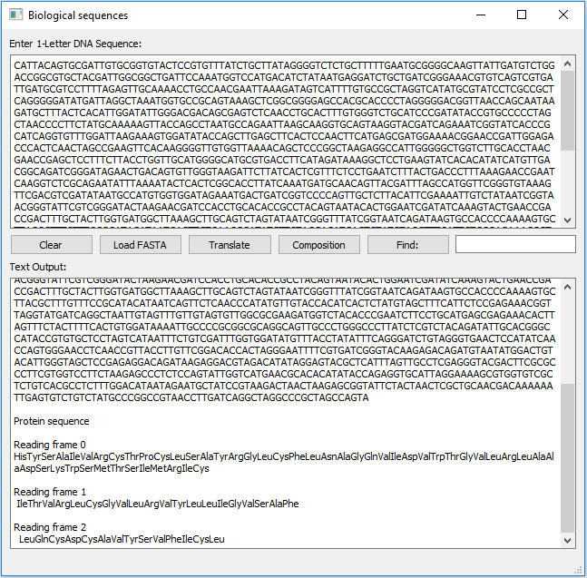

# Biological Sequences

A simple graphical interface for some of the biological sequence analysis.
GUI is desgined using PyQt Designer.

- As the name hints Translate will translate the DNA sequence into three-letter protein sequences.

- Composition counts the different DNA letters.

- Load Fasta can be used to read DNA sequence from a Fasta file.

- Find is used for finding a query DNA sub-sequence.

 
<b>Figure 1. Graphical interface to operate simple DNA sequence analysis functionality</b> 

# Binaries

Executable files for Windows & Linux (64 bit) are available in the Binaries folder.

# Source Code

Source code is available in the Scripts folder.

# Reference

Stevens, T., & Boucher, W. (2015). Graphical interfaces. In Python Programming for Biology: Bioinformatics and Beyond (pp. 566-581). Cambridge: Cambridge University Press. doi:10.1017/CBO9780511843556.027

